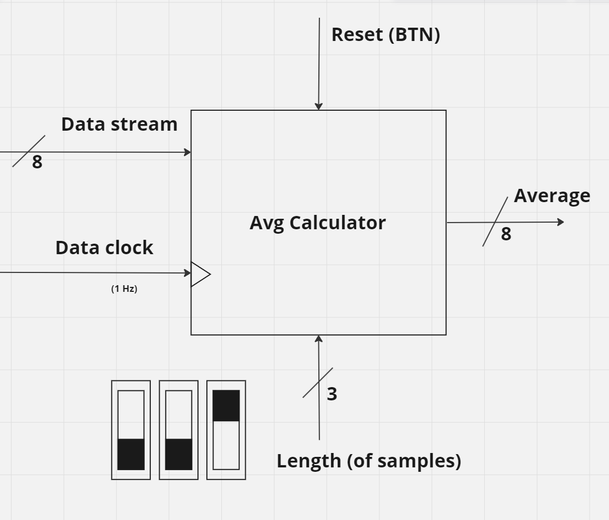
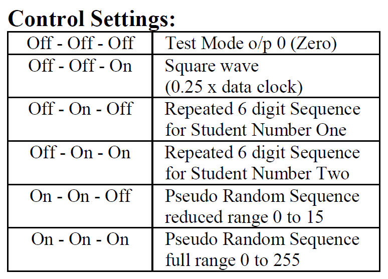
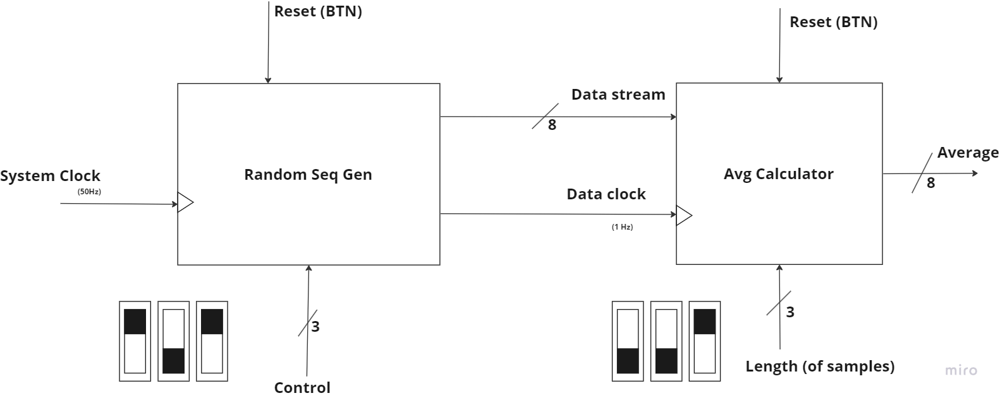

# Average Calculator

## Description

A project written in VHDL that calculates the average of a variable length stream of numbers. The project is designed to be run on an FPGA, and the average is calculated in real time as the numbers are streamed in.

## Usage

It's meant to be run on the Nexys A7-100T model of FPGA. The `Control Mode` and the `Buffer Length Mode` are explained in the [Controls](#controls) section.

## Controls

This implementation uses the built-in switches of the board: 3 switches for controlling the frequency at which the average is calculated

...and another 3 switches for the Control Mode.

## Black Box Diagram

## Authors

- [Alex Balint]()
- [Serban Afrasinei](https://github.com/AfraIsNotAvailable)
